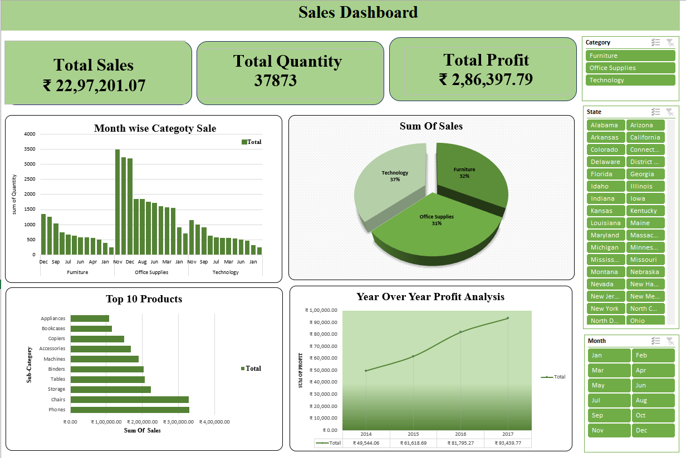

# Sales Performance Analysis Dashboard

## Project Overview
This project features a comprehensive **Sales Performance Analysis Dashboard** built using Microsoft Excel. It is designed to visualize critical business metrics including total sales, quantity sold, profit margins, and historical trends to support data-driven decision-making.

## Key Insights
* **Total Sales:** ₹ 22,97,201.07
* **Total Quantity Sold:** 37,873 units
* **Total Profit:** ₹ 2,86,397.79
* **Top 10 Products:** Identified top-performing products based on sales volume and revenue.
* **Year-Over-Year Analysis:** Tracked profit growth and sales trends across different fiscal periods.

## Dashboard Screenshot

## Tools & Techniques Used
* **Microsoft Excel:** Advanced Pivot Tables for data summarization.
* **Interactive Slicers:** For dynamic filtering by Region, Category, and Time.
* **Data Visualization:** Utilizing Clustered Bar Charts, Pie Charts, and Line Graphs for trend analysis.
